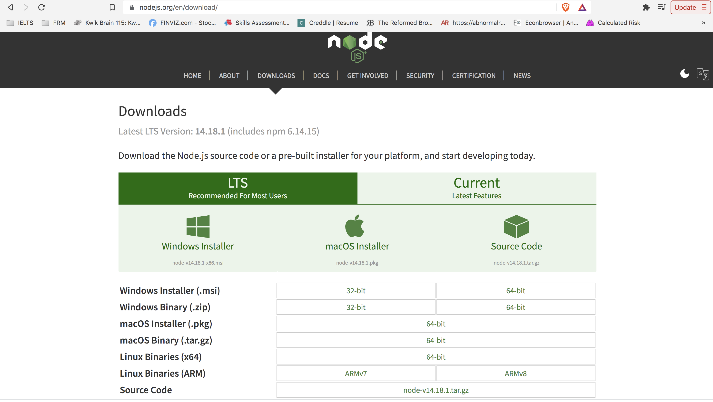
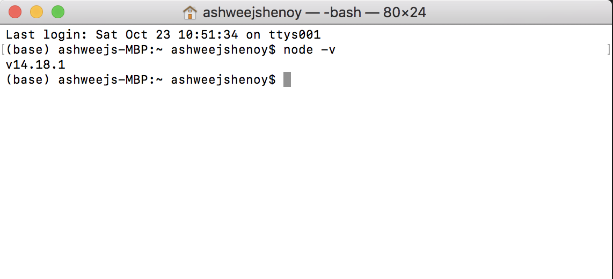
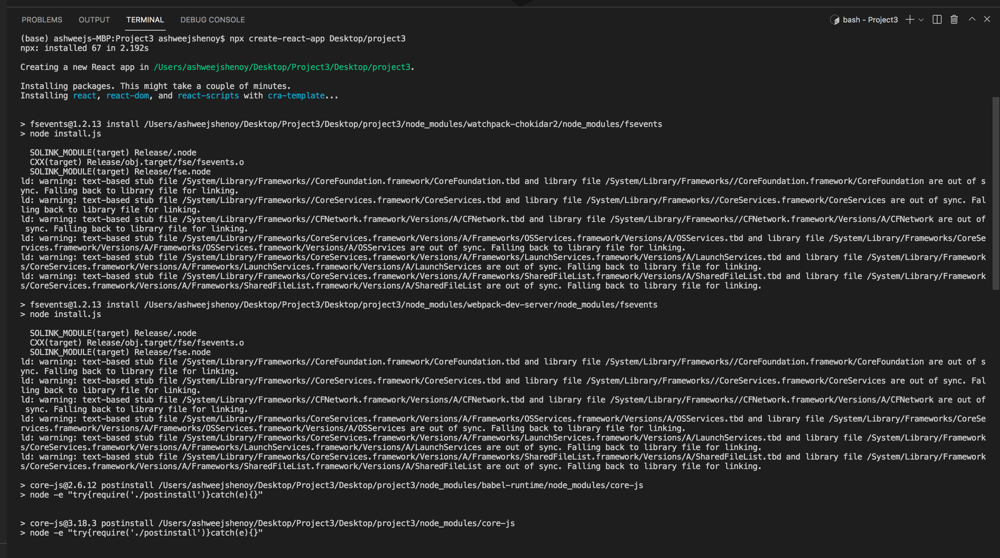
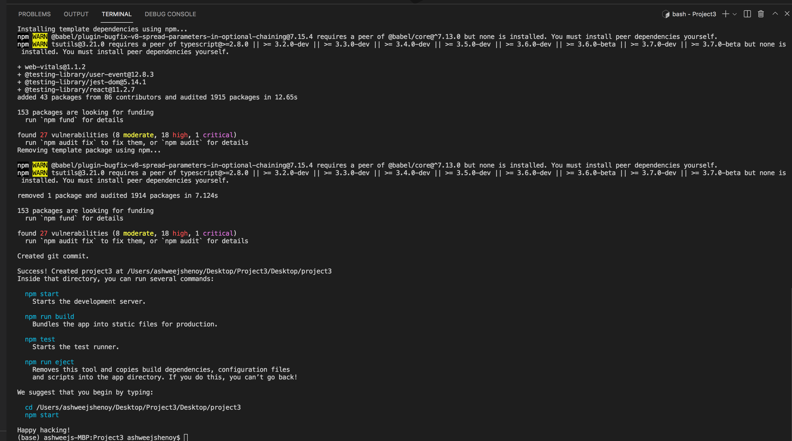

# **Installation Guide**

1. Node.js

    Step 1: Navigate to https://nodejs.org/en/download/. Download the package suitable for your Operating system

    

    Step 2: Check the version of Node.js, type the below in terminal

    `node -v`

    

    Step 3: Creating React in vscode. In the terminal window, type the below

    `npx create-react-app <Project Path>`

    
    

2. 
