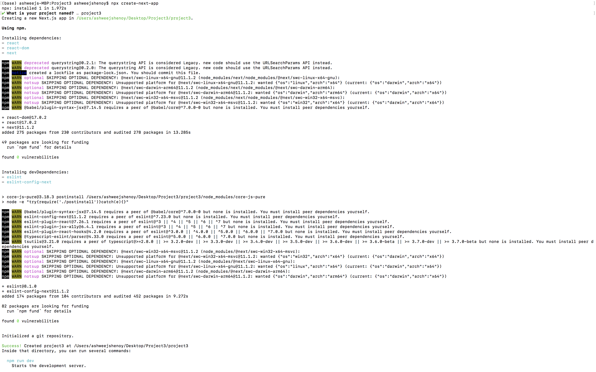
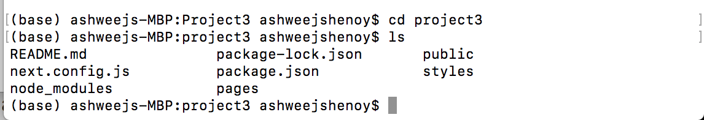
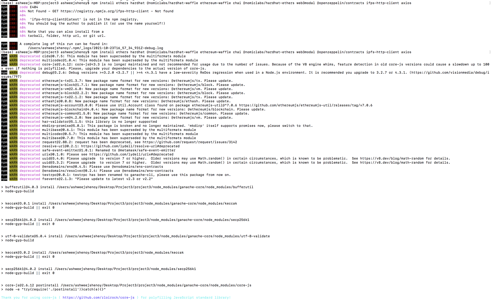
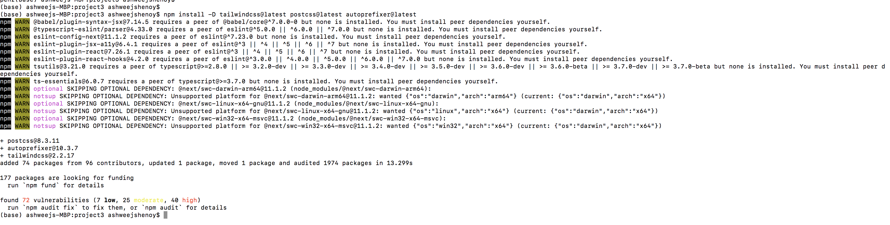

# **Installation Guide**

1. Node.js

    Step 1: Navigate to https://nodejs.org/en/download/. Download the package suitable for your Operating system

    

    Step 2: Check the version of Node.js, type the below in terminal

    `node -v`

    

    Step 3: Creating React in vscode. In the terminal window, type the below

    `npx create-react-app <Project Path>`

    
    

2. Next.js

    Step 1: Navigate to your project folder in terminal and execute the below command. Enter the project name when prompted for.

    `npx create-next-app`

    

    Step 2: Check the installation. Navigate to the folder and check the contents

    `cd Project3`
    `ls`

    

3. Install the below on the terminal 

    * ethers 
    * hardhat 
    * @nomiclabs/hardhat-waffle 
    * ethereum-waffle chai 
    * @nomiclabs/hardhat-ethers 
    * web3modal 
    * @openzeppelin/contracts 
    * ipfs-http-client 
    * axios 
    
     

    `npm install ethers hardhat @nomiclabs/hardhat-waffle ethereum-waffle chai @nomiclabs/hardhat-ethers web3modal @openzeppelin/contracts ipfs-http-client axios`

    

4. Install Styling tools

    * tailwind
    * postcsss
    * autofixer
     

    `npm install -D tailwindcss@latest postcss@latest autoprefixer@latest`

    

    

