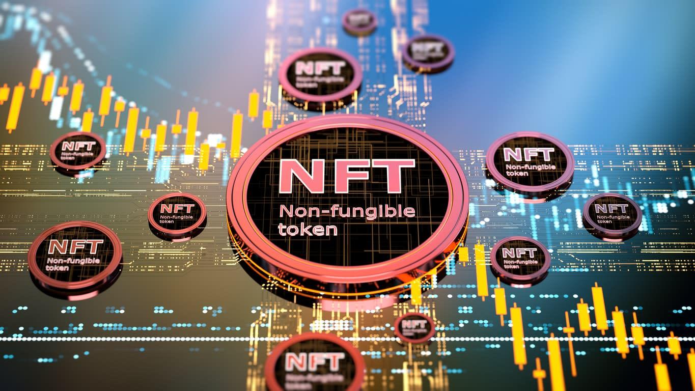

# **Project 3 Non Fungible Token Market Place**

---
## **Background**
---
Today, NFT or Non Fungible Tokens has piqued everybodys attention and has changed lives of digital artists. Celebrities are joining this bandwagon as new way to connect with their fans. 
According to Ethereum.org, NFTs are tokens that we can use to represent ownership of unique items like art, collectibles, even real estate. They establish ownership of these items,as they are secured by immutable nature of blockchain.

---
## **Objective**

To build a smart contract that allows for design of NFT and build a NFT market place.

---
## **Technologies**
* Solidity
* React
* Node.js
* ethers
* hardhat
* @nomiclabs/hardhat-waffle
* ethereum-waffle chai
* @nomiclabs/hardhat-ethers
* web3modal
* @openzeppelin/contracts
* ipfs-http-client
* axios
---
## **Installation guide**
The [installation guide][Installation_Guides/Installation Guide.md] for node.js, ethers, hardhat, ethereum-waffel, web3modal, ipfs, axios can be found in installation folder.
---
## **Contributors**
* [Bailey Carlson](https://github.com/BaileyCT)
* [Wesley Osborne](https://github.com/WesleyOsborne)
* [Jordan Candido](https://github.com/JordanCandido)
* [Lucas Nardy](https://github.com/lucaspsnardy)
* [Ashweej Shenoy](https://github.com/ashweej18)

---

## License
 
